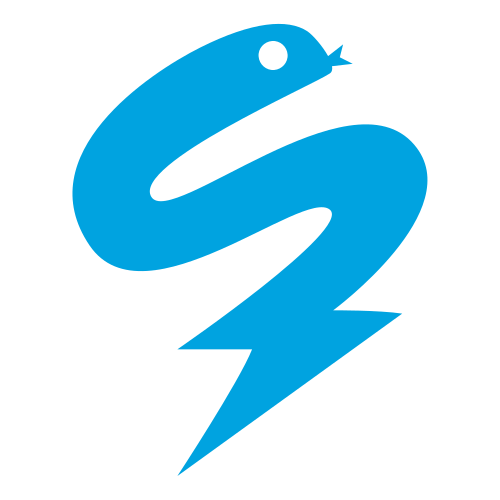

<h1 align="center">Hi 👋, I'm Aritra Biswas</h1>
<h3 align="center">Working as Data Scientist at AB-InBev.</h3>

  

- 🔭 I’m currently working on **automated media mix marketing tool**

- 🌱 I’m currently learning **TensorFlow**

- 💬 Ask me about **Python and R**

- 📫 How to reach me **pandalearnstocode@gmail.com**

<h3 align="left">Connect with me:</h3>

<h3 align="left">Languages and Tools:</h3>

  </a> <a href="https://cran.r-project.org/" target="_blank">       </a>      <a href="https://www.w3schools.com/cpp/" target="_blank">    

